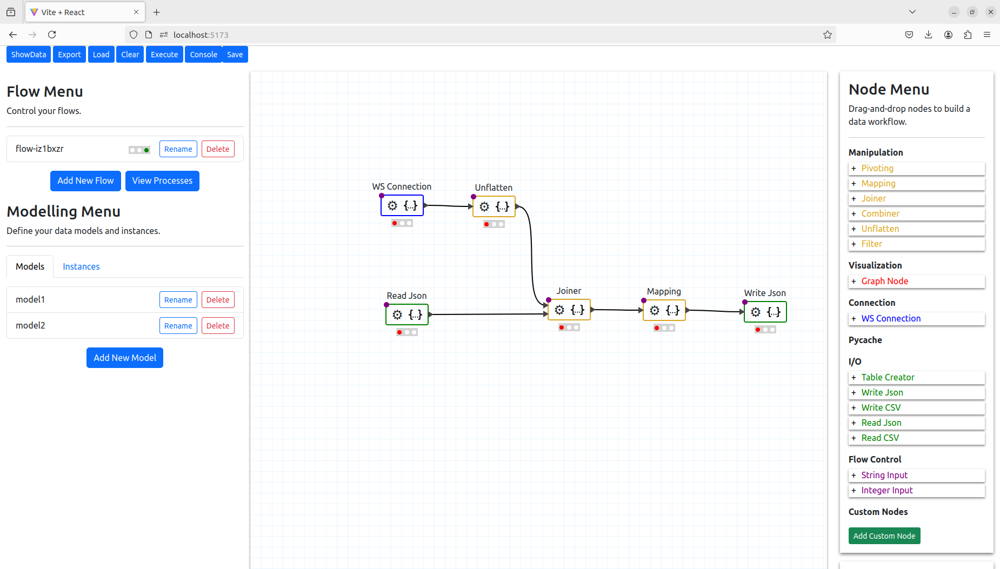

This is a research project to build data flows for Matter based IoT devices. The project builds on the work from the [Visual Programming project](https://github.com/PyWorkflowApp/visual-programming) and is based on React, React Bootstrap and [react-diagrams](https://github.com/projectstorm/react-diagrams)

# User Interface Example




# Installation

### Server (Django)

```
cd api
```

1. Install and activate python3.12 `virtual environment` 

```
/usr/bin/python3.12 -m venv ./venv
source venv/bin/activate
```

***On Mac OS***
Installing and activating python3.12 on Mac OS

Ensure you install python3.12

```
brew install python@3.12
```

Ensure you use the correct python binary path when activating the environment

```
/usr/local/bin/python3 -m venv ./venv
source venv/bin/activate
```

2. Install `pipenv`
       
- **pip**
    
```
pip install pipenv OR pip3 install pipenv
```        
3. Install dependencies
In the `api` directory with `Pipfile` and `Pipfile.lock`.
```
pipenv install
```
4. Setup your local environment

- Create environment file with app secret 
```
echo "SECRET_KEY='TEMPORARY SECRET KEY'" > mf/.environment
```

4.1. (Optionally) set location of db-sqlite3 file

- Create environment variable your specific db path 
```
echo "DB_DIR_PATH='/tmp'" >> mf/.environment
```

5. Start dev server from app root
```
cd mf
pipenv run python3 manage.py migrate
pipenv run python3 manage.py runserver
```
    
If you have trouble running commands individually, you can also enter the
virtual environment created by `pipenv` by running `pipenv shell`.

### Supervisor
This project requires supervisord to control unix based processes which run the flows in the background. To install supervisor follow these steps:

1. Install supervisor

```
pip install supervisor
```

2. Start/Restart the supervisor

Cd to the `api` directory with `supervisord.conf` file
```
supervisord -c ./supervisord.conf 
```

3. Check the status of the supervisor

```
supervisorctl status
```

Note: there should be one process running that is specified in the supervisor_confs folder and defined in the foo.conf file

### Web Client 
In a separate terminal window, perform the following steps to start the
front-end.

1. Install Prerequisites
```
cd web
npm install
```
2. Start dev server
```
npm run dev
```

By default, your default browser should open on the main
application page. If not, you can go to [http://localhost:5173/](http://localhost:5173/)
in your browser.

### Storybook

It is possible to run the react components in Storybook. The backend is mocked in that case.
If running as Storybook, then the backend API will only provide static information and the
functionality of adding, deleting, modifying, saving etc will not be saved to the backend

1. Run as Storybook
```
cd web
npm run storybook
```

Note: it is not recommended to run as storybook as the lack of backend functionality will 
impact the functionality of the front end.

### Docker

It is possible to run this application as a docker container on amd64 using

```
docker run --rm   -p 4173:4173 -p 5173:5173 -p 8000:8000 -p 9001:9001   -v /path/to/all_addon_configs:/path/in/container:rw   -v /data:/tmp:rw   oideibrett/matterflow:amd64
```

It is also possible to run this as a Home Assistant Addon

#### Add the Repository

1. Go to the **Add-on store** in Home Assistant.
2. Click **⋮ → Repositories**, and paste the following URL:
   
[https://github.com/MatterCoder/addon-matterflow](https://github.com/MatterCoder/addon-matterflow)

Click **Add → Close**, or click the button below to add the repository directly:  
[](https://my.home-assistant.io/redirect/supervisor_add_addon_repository/?repository_url=https%3A%2F%2Fgithub.com%2FMattercoder%2Faddon-matterflow)
